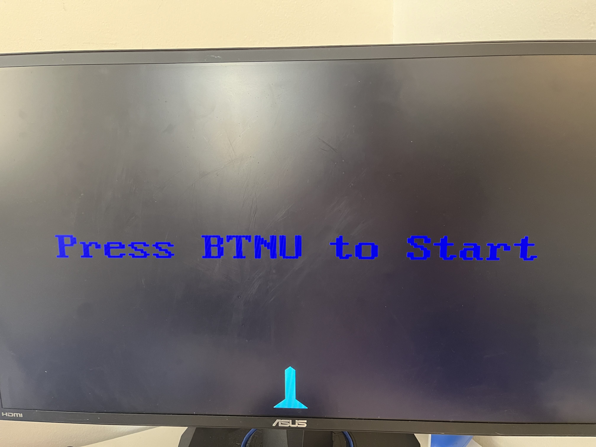
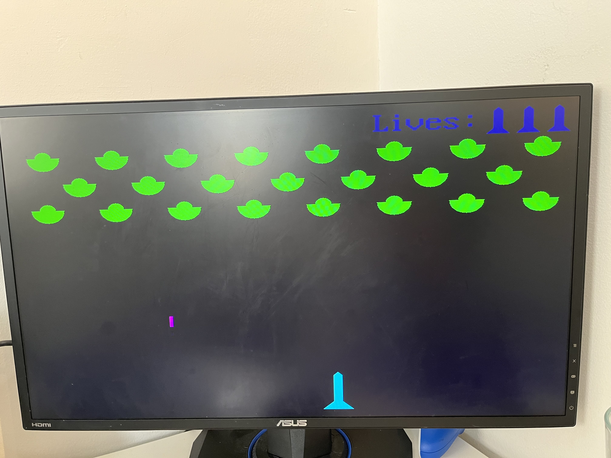
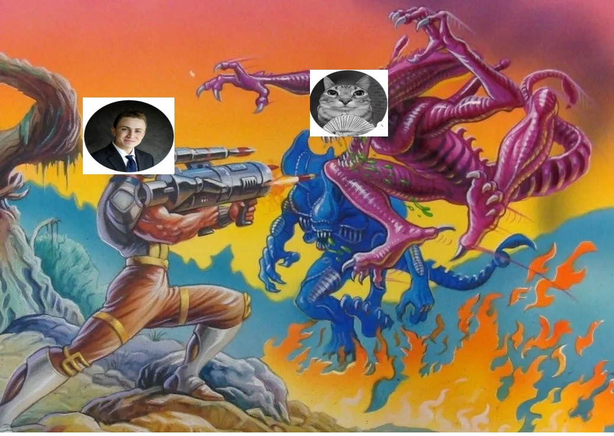

# Final Project: Space Invaders

> # **[Project Instructions](https://github.com/moshem1234/dsd/blob/CPE487-Spring2024/Projects/README.md)**

## Expected Behavior

> TODO: Describe regular space invaders gameplay in a few bullets

* Our goal in making this project is to mimic the gameplay of the Space Invaders video game (Above) as closely as possible.
* ...
* ...
* ...

## Neccessary Hardware

* [Nexys A7-100T FPGA Board](https://digilent.com/shop/nexys-a7-fpga-trainer-board-recommended-for-ece-curriculum/)
* Computer with *[Vivado](https://www.xilinx.com/products/design-tools/vivado.html)* installed
* Micro-USB Cable
* VGA Cable
* Monitor/TV with VGA input or VGA adapter

## Module Overview

* The **_[leddec16](/leddec16.vhd)_** module controls the displays on the Nexys A7 board.
  * By time multiplexing the 7-segment displays that share the same cathode lines (CA to CG), four different digits can appear on one display at a time.
    * Turn on display 0 for a few milliseconds by enabling its common anode AN0 and decoding data(0~3) to drive the cathode lines.
    * Switch to display 1 for a few milliseconds by turning   off AN0, turning on AN1 and decoding data(4~7) to drive the cathode lines.
    * Shift to display 2 for a few milliseconds and then finally display 3 for a few milliseconds, after that go   back and start again at display 0.
    * While each digit is thus illuminated only one quarter of the time, it will appear to the naked eye that they're all on continuously.
  * The multiplexing clock (above) is controlled via the 'dig' input.
  * The score to display is controlled from the 'data' input.

* The **_[ship_n_laser](/bat_n_ball.vhd)_** module draws the ship, aliens, and laser(s) on the screen, controlling their movements and actions.
  * 95% of the gameplay logic can be found in this module.
  * Specific details can be found in [Code Sources / Modifications](#code-sources--modifications).

* The **_[clk_wiz_0](/clk_wiz_0.vhd)_** and **_[clk_wiz_0_clk_wiz](/clk_wiz_0_clk_wiz.vhd)_** modules were taken from the [given code for Lab 6](https://github.com/byett/dsd/tree/CPE487-Spring2024/Nexys-A7/Lab-6) and left unmodified. These modules control the clock processes of the Nexys A7 board.
  * The Xilinx [Clocking Wizard](https://www.xilinx.com/products/intellectual-property/clocking_wizard.html)
  * [7 Series FPGAs Clocking Resources User Guide](https://www.xilinx.com/support/documentation/user_guides/ug472_7Series_Clocking.pdf)
  * CLKOUT0_DIVIDE_F in Line 124 of clk_wiz_0_clk_wiz.vhd was updated from 25.3125 to 25.25 because it shall be a multiple of 0.125

* The **_[vga_sync](/vga_sync.vhd)_** module (also given and unmodified) uses a clock to drive horizontal and vertical counters h_cnt and v_cnt, respectively.
  * These counters are then used to generate the various timing signals.
  * The vertical and horizontal sync waveforms, vsync and hsync, will go directly to the VGA display with the column and row address, pixel_col and pixel_row, of the current pixel being displayed.
  * This module also takes as input the current red, green, and blue video data and gates it with a signal called video_on.
  * This ensures that no video is sent to the display during the sync and blanking periods.
  * Note that red, green, and blue video are each represented as 1-bit (on-off) quantities.
  * This is sufficient resolution for our application.

* The **_[space_invaders](/pong_2.vhd)_** module is the top level.
  * Minor modifications were made to the [given Lab 6 file](https://github.com/byett/dsd/blob/CPE487-Spring2024/Nexys-A7/Lab-6/Alternative/pong_2.vhd) to fit with our adjusted **_[ship_n_laser](/bat_n_ball.vhd)_** module
  * All 5 of the buttons on the lower right of the Nexys A7 board are used in this gameplay.
    * BTNU (Up) is used to start the game.
    * BTNC (Center) is used to shoot the lasers.
    * BTNL (Left) and BTNR (Right) are used to move the ship left and right, respectively.
    * BTND (Down) is used to quit the game.

## Code Sources / Modifications

### Modifications from [Lab 6 Alternate Code](https://github.com/byett/dsd/blob/CPE487-Spring2024/Nexys-A7/Lab-6/Alternative) ([pong_2.vhd/space_invaders.vhd](/pong_2.vhd) and [pong_2.xdc/space_invaders.xdc](/pong_2.xdc))

* Changed entity name from 'pong' to 'space_invaders'
* Changed all instances of 'bat' to 'ship' and 'ball' to 'laser'
* Initialized ship_x position to `CONV_STD_LOGIC_VECTOR(400,11)` in order to start the ship in the center of the screen.
* Added/Modified btnu (start), btnd (quit), and btnc (shoot) input ports and mapped accordingly to ship_n_laser component
* Added 'score' output port to ship_n_laser component and mapped to leddec 'data' port

<!-- > TODO: List processes in *ship_n_laser* and describe logic for each one -->

### Processes added into ship_n_laser architecture

1. draw_ship
    - This process draws the ship that will be controlled by the player.
    - Has multiple if statements to draw the shape of the ship, which is a combination of 4 triangles and a rectangle.
2. draw_laser
    - This process draws the shape of the laser that the player will shoot from their ship.
    - The laser is a simple rectangle with a height and width that is dependant on the values of the laser_h and laser_w constants.
3. move_laser
    - This process determines the position of the player's laser. 
    - The laser will stay in its idle position (just above the ship) if the game is not in play or the laser has not been shot. The "game_on" and "laser_shot" signals determine if the laser stays still or starts moving.
    - The equation to find the next vertical position was taken from the lab 6 code that determined the next position of the ball.
    - This process also has the code that determines if the game is currently in play or not. The game will stop if the player wins, loses, or quits their current round of aliens.
4. shoot_laser
    - This process determines if the player's laser should appear on the screen or not.
    - If the player presses BTNC and the game is currently in play then the laser is shot. But if the laser touches the top of the screen or the game is not in play, then the laser will disappear.
    - This process also controls the collisions between the aliens and the player's laser and causes the aliens to disappear and the score to increase when they collide. 
    - The X and Y coordinates of the 23 ships are stored in an array so that it is easy to loop through the array and check if the laser was close enough to collide with the alien.
    - This process resets the score whenever the loser does not win the round they are currently on.
    - Lastly, this processes causes the aliens to appear whenever there is a new round and increases their speed to make the game harder after the first round.
5. draw_aliens
    - This process controls the shape of the enemy aliens.
    - The aliens are meant to look like UFOs.
    - To do this, the top half of a small semicircle was placed on top of the bottom half of a larger semicircle.
6. move_aliens
    - This process controls the movement of the aliens.
    - The aliens move side to side and when they hit one of the side walls, they move downwards, closer to the player.
    - This process also causes the player to lose the game if the aliens get too close to the ship.
7. draw_alien_laser
    - This process draws the shape of the laser that the enemy aliens shoot. It is the same size and shape as the laser that the player shoots.
8. move_alien_laser
    - This process determines which alien the enemy laser starts from. To simulate that a random alien is shooting at the player, an array of integers from 0 to 22 was created and a variable was created to iterate through that array to get the random number.
    - This process also checks if the player's ship and the enemy laser have collided and decreases the player's lives by 1 if they have collided.

## Hardware Instructions

### 1. On your Nexys A7 board, connect the VGA port (Red) to your monitor, the USB port (Blue) to your computer, and ensure that the power switch (Purple) is set to "on". Note that adapters may be needed depending on your specific hardware

## Vivado Project Instructions

> TODO: (Maybe) Add pictures

### 1. Clone this github repository to your PC (Or download the files manually)

### 2. Create a new RTL project _Space_ in Vivado Quick Start

* Import VHDL source files: **_[clk_wiz_0](/clk_wiz_0.vhd)_**, **_[clk_wiz_0_clk_wiz](/clk_wiz_0_clk_wiz.vhd)_**, **_[vga_sync](/vga_sync.vhd)_**, **_[bat_n_ball](/bat_n_ball.vhd)_**, **_[leddec16](/leddec16.vhd)_** and **_[pong_2](/pong_2.vhd)_**

* Import constraint file: **_[pong_2](/pong_2.xdc)_**

* Choose Nexys A7-100T board for the project

* Click 'Finish'

### 3. Run Synthesis

### 4. Run Implementation

### 5. Generate Bitstream, Open Hardware Manager, and Program Device

* Click 'Generate Bitstream'

* Click 'Open Hardware Manager' and click 'Open Target' then 'Auto Connect'

* Click 'Program Device' then xc7a100t_0 to download space_invaders.bit to the Nexys A7-100T board

## Alternative Vivado Instructions

### 1. Download **_space_invaders.bit_** from our [releases](https://github.com/vrenda720/DSD_Project/releases) page

### 2. Open Vivado

### 3. From the **Tasks** Menu, select **_Open Hardware Manager_**

### 4. Select **_Open Target_**, then **_Auto Connect_**

### 5. Click **_Program Device_** then select the downloaded bitstream file, and click **_Program_**

## Gameplay Summary

<!-- > TODO: Include sentence description and video/GIF for each of the following:
>
> * Flashing text after first programmed
> * Game in action
>   * Losing lives when hit
>   * Aliens disappearing when shot
>   * Score going up when aliens hit
> * Game win + Win Screen
> * Game loss (out of lives) + Lose Screen
> * Game loss (Aliens fall too low) + Lose Screen
> * Game quit + Lose screen -->
* When the bitstream is initially uploaded to the FPGA board, the player will be able see their ship and flashing text that says "Press BTNU to Start".

* Once BTNU is clicked, the aliens will appear and start shooting downwards towards the player. The player will have to dodge the enemy lasers and shoot back at the aliens. If an enemy laser hits the player they will lose one of the lives that are indicated on the top right of the screen.

* The player will be able to move their ship left and right by pressing BTNL and BTNR respectively.
* Pressing BTNC will allow the player to shoot back at the aliens. Hitting an alien with a laser will cause that alien to disappear and the players score will increase, the player's score is visable on the FPGA board itself.
* By eliminating all the aliens on the screen, the player will have won that round and a screen will appear that says, "You Win" and "Press BTNU to Continue". If the player chooses to continue, they will keep their score and more aliens will appear but this time they will move faster.

* If the player is unable to dodge the lasers being shot at them and lose all 3 of their lives, a screen will appear that says, "You Lose" and "Press BTNU to Restart". When the player presses BTNU, new aliens will appear and their score will be reset.

* If the player chooses to quit the current round they are in by pressing BTND, a screen will appear that says, "You Lose" and "Press BTNU to Restart". When the player presses BTNU, new aliens will appear and their score will be reset.
* If the player is not able to eliminate all the aliens before they touch the ship, a screen will appear that says, "You Lose" and "Press BTNU to Restart". When the player presses BTNU, new aliens will appear and their score will be reset.

